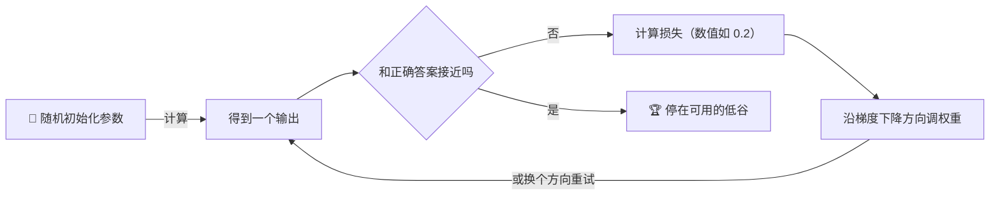
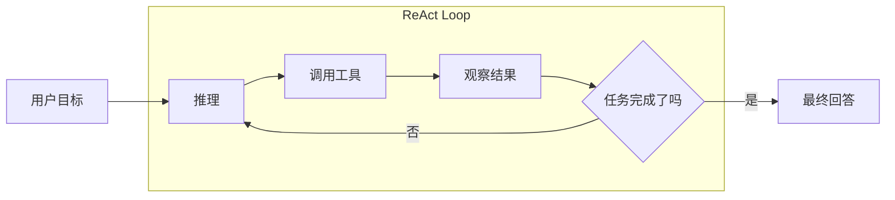
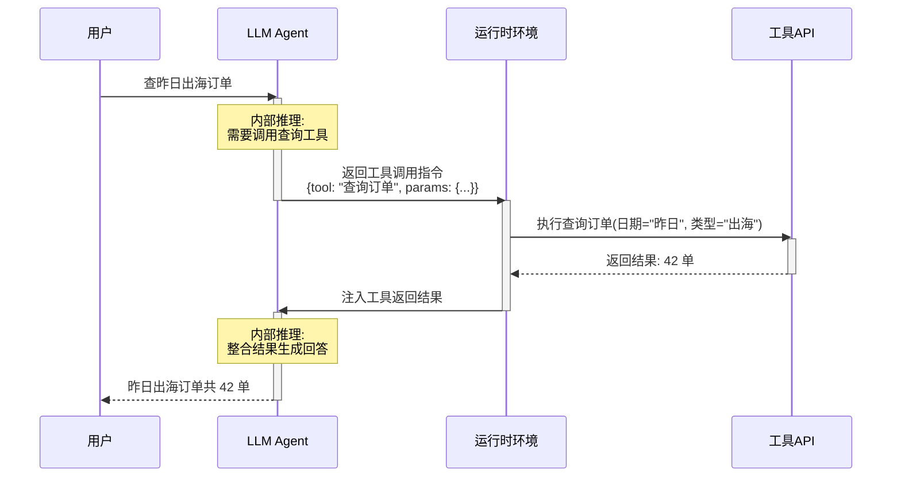
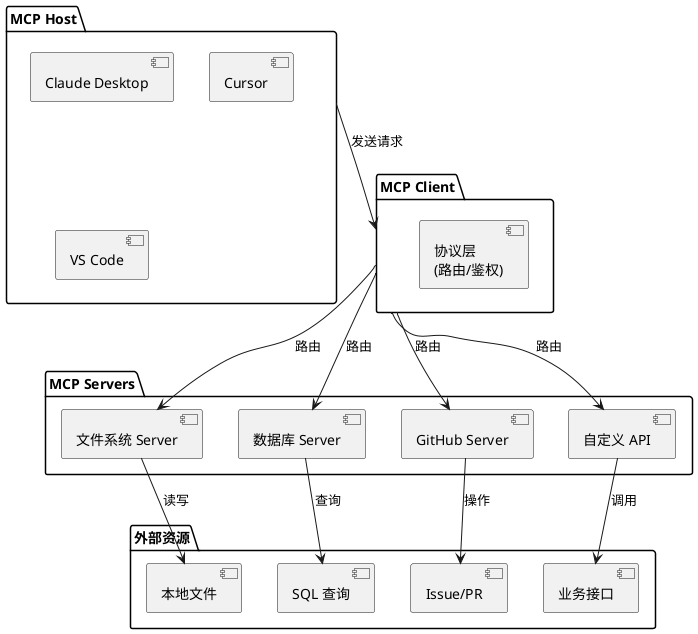
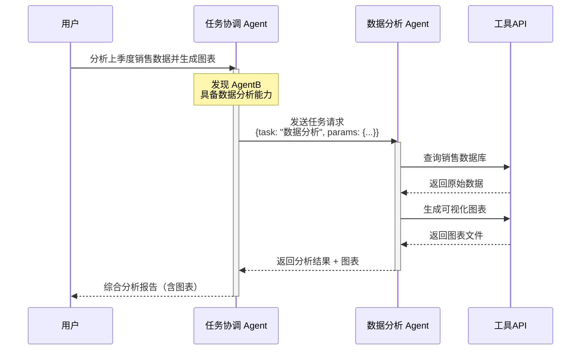
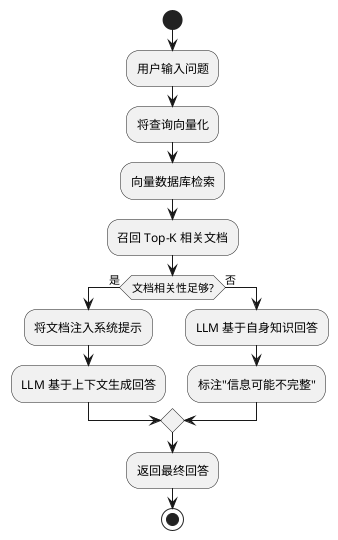
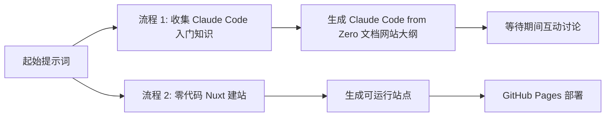

---
layout: cover
class: page-claude-from-zero page-home
---

<div class="cmpt-group-hero">
  <div>
    <div class="cmpt-kicker">介绍 / 开场</div>
    <h1 class="mt-5">
      Claude from <span class="cmpt-grad-text">Zero</span>
    </h1>
    <p class="cmpt-group-hero__statement">
      先概念后实战，用完整的应用制作过程，把 <Terms term="token">token</Terms>、概率、<Terms term="agent">agent</Terms>、<Terms term="skills">skills</Terms>、<Terms term="mcp">MCP</Terms> 串成一条能落地的线。
    </p>
    <div class="cmpt-group-hero__meta">
      <span>一个小时</span>
      <span>面向新手</span>
      <span>有交付</span>
    </div>
    <div class="mt-8 text-sm">
      <a href="https://github.com/Lionad-Morotar" target="_blank">
        杨韵树
      </a>@86links
    </div>
  </div>

  <CmptPanel class="rounded-[2rem] p-5">
    <GlassHeroScene class="cmpt-glass-hero-scene" />
  </CmptPanel>
</div>

---
class: page-claude-from-zero
---

<div class="grid gap-8 h-full">
  <div>
    <div class="cmpt-kicker">01 / Me</div>
    <h2 class="mt-5">我做过什么</h2>
    <ul class="cmpt-bullet-list mt-14">
      <li>长期折腾工具链</li>
      <li>实践尺度达到月百亿级</li>
      <li>喜欢小工具，上过阮一峰周刊</li>
      <li>已知唯一在 K2.6 preview 阶段评测其增强方向</li>
    </ul>
  </div>
</div>

---
class: page-claude-from-zero
---

<div class="grid grid-cols-[0.95fr_1.05fr] gap-8">
  <div>
    <div class="cmpt-kicker">02 / 分享目标</div>
    <h2 class="mt-5">这场分享想解决什么</h2>
    <p class="mt-5 text-lg leading-8">
      抛砖引玉
    </p>
    <div class="cmpt-footer-note">
      弥合 AI 零基础与理解/使用 Claude 之间的鸿沟，通过零代码上线网站的现场案例，让产研学会完整的应用制作过程，同时对齐今后的 AI 术语
    </div>
  </div>

  <CmptPanel class="rounded-[1.7rem] p-6">
    <div class="text-sm uppercase tracking-[0.18em]">60 分钟后</div>
    <ul class="cmpt-bullet-list mt-5">
      <li>对 <Terms term="token">token</Terms>、大模型、<Terms term="mcp">MCP</Terms>、<Terms term="skills">skills</Terms>、<Terms term="agent">agent</Terms>、<Terms term="vibe-coding">vibe coding</Terms> 有清晰概念。</li>
      <li>知道如何使用 <Terms term="claude-code">Claude Code</Terms> 走完一个微型应用的完整生命周期。</li>
      <li>消除“AI 很难”的心理壁垒，至少愿意开始试第一步。</li>
    </ul>
  </CmptPanel>
</div>

---
class: page-claude-from-zero
---

<CmptPanel class="rounded-[1.7rem] p-6">
  <div class="cmpt-kicker">时间线 / 60 分钟</div>
  <h2 class="mt-4">时间分配总览</h2>

  <table class="cmpt-table mt-6">
    <thead>
      <tr>
        <th>阶段</th>
        <th>时长</th>
        <th>内容</th>
      </tr>
    </thead>
    <tbody>
      <tr>
        <td><Terms term="llm">LLM</Terms> 基于概率</td>
        <td>15min</td>
        <td>概率、<Terms term="neural-network">神经网络</Terms>、学习机制</td>
      </tr>
      <tr>
        <td><Terms term="agent">Agent 是一个循环</Terms></td>
        <td>15min</td>
        <td><Terms term="token">Token</Terms>、<Terms term="chat">Chat</Terms>、<Terms term="agent">Agent</Terms>、工程概念</td>
      </tr>
      <tr>
        <td>网站</td>
        <td title="看情况缩减">20min*</td>
        <td>网站搭建及发布</td>
      </tr>
    </tbody>
  </table>
</CmptPanel>

---
layout: cover
class: page-claude-from-zero
---

<div class="cmpt-group-hero">
  <div>
    <div class="cmpt-kicker">章节 / 为什么是 <Terms term="claude-code">CC</Terms></div>
    <h1>为什么是 <Terms term="claude-code">Claude Code</Terms></h1>
    <p class="cmpt-group-hero__statement">
      本地、可控、深度集成。学 <Terms term="claude-code">Claude Code</Terms>，不是因为它看起来更酷，而是因为专业级产出离不开对关键中间环节的掌控。
    </p>
    <div class="cmpt-group-hero__meta">
      <span>Claude Code</span>
      <span>OpenClaw</span>
      <span>...</span>
    </div>
  </div>

  <div class="cmpt-side-stack">
    <CmptPanel class="rounded-[1.5rem] p-5">
      <div class="text-sm uppercase tracking-[0.16em]">工作模式</div>
      <div class="mt-5 grid grid-cols-3 gap-3 text-center">
        <div class="border-2 border-[#16110f] bg-[#f8f1e6] p-4">
          <div class="text-sm">任务</div>
          <div class="mt-2 text-xl shrink-0">可介入</div>
        </div>
        <div class="border-2 border-[#16110f] bg-[#f8f1e6] p-4">
          <div class="text-sm">产物</div>
          <div class="mt-2 text-xl shrink-0">可控</div>
        </div>
        <div class="border-2 border-[#16110f] bg-[#f8f1e6] p-4">
          <div class="text-sm">环境</div>
          <div class="mt-2 text-xl shrink-0">集成</div>
        </div>
      </div>
    </CmptPanel>
  </div>
</div>

---
class: page-claude-from-zero
---

<div class="cmpt-section-grid">
  <div>
    <div class="cmpt-kicker">为什么 / 三个维度</div>
    <h2 class="mt-5">为什么是 CC，而不是网页版 <Terms term="agent">Agent</Terms></h2>
    <ul class="cmpt-bullet-list mt-6">
      <li><strong>任务可拆。</strong> 智力外包不能积累经验，但在具体任务可以体力外包。</li>
      <li><strong>高质量输出，依赖关键步骤的输入。</strong> 人在关键节点上“垫”一下，最终效果会差非常多。</li>
      <li><strong>集成式环境减少<Terms term="context">上下文</Terms>切换。</strong> 一件事在一个工作台里做完，思维损耗最小。</li>
    </ul>
  </div>

  <div class="cmpt-side-stack">
    <CmptPanel class="rounded-[1.5rem] p-5">
      <div class="text-[#16110f] text-lg font-semibold">例子：先垫，再生成</div>
      <p class="mt-3 text-sm leading-7">
        先用高质量文生图模型生成漂亮照片，再把照片交给视频模型做运动扩展。
        每一步的“垫”都在把概率空间往更好的方向推。
        <PreviewIcon src="/assets/design/gpt-image-seedance.gif" />
      </p>
    </CmptPanel>
    <CmptPanel class="rounded-[1.5rem] p-5">
      <div class="text-[#16110f] text-lg font-semibold">开发环境的价值</div>
      <p class="mt-3 text-sm leading-7">
        工具不需要跳来跳去，文件、终端、<Terms term="context">上下文</Terms>、结果都在一个环境里。
        这不是仪式感，是效率和稳定性。
      </p>
    </CmptPanel>
  </div>
</div>

---
layout: cover
class: page-claude-from-zero
---

<div class="cmpt-group-hero">
  <div>
    <div class="cmpt-kicker">章节 / <Terms term="llm">LLM</Terms></div>
    <h1><Terms term="llm">LLM</Terms> 基于概率</h1>
    <p class="cmpt-group-hero__statement">
      它不是查表也不是经典 if-else。它是一个巨大的黑盒，通过海量参数，把“下一个最可能出现什么”算出来。
    </p>
    <div class="cmpt-group-hero__meta">
      <span>黑盒</span>
      <span>概率</span>
      <span>万亿参数</span>
    </div>
  </div>

  <CmptPanel class="rounded-[2rem] p-6">
    <ProbabilityBars class="cmpt-probability-bars" />
  </CmptPanel>
</div>

---
class: page-claude-from-zero
---

<div class="h-full grid grid-rows-[auto_auto_1fr] gap-5">
  <div class="cmpt-kicker">01 / 小朋友怎么学习</div>
  <h2>传统编码 vs 机器学习</h2>

  <ComparePanel />
</div>

---
class: page-claude-from-zero
---

<div class="cmpt-section-grid">
  <div>
    <div class="cmpt-kicker">02 / <Terms term="neural-network">神经网络</Terms>结构</div>
    <h2 class="mt-5"><Terms term="input-layer">输入层</Terms>、<Terms term="hidden-layer">隐藏层</Terms>、<Terms term="output-layer">输出层</Terms></h2>
    <ul class="cmpt-bullet-list mt-6">
      <li>左侧<Terms term="input-layer">输入层</Terms>：颜色、形状、气味等属性并行进入。</li>
      <li>中间<Terms term="hidden-layer">隐藏层</Terms>：发生了复杂计算，但我们无法直观看懂它在“想什么”。</li>
      <li>右侧<Terms term="output-layer">输出层</Terms>：给出"这是苹果"的概率结果。
        <PreviewIcon src="/assets/images/neural-network-apple-v3.jpg" />
      </li>
    </ul>
  </div>

  <CmptPanel class="rounded-[1.7rem] p-5">
    
  </CmptPanel>
</div>

---
class: page-claude-from-zero
---

<div class="cmpt-section-grid">
  <div>
    <div class="cmpt-kicker">03 / 规模带来质变</div>
    <h2 class="mt-5">从<Terms term="neural-network">神经网络</Terms>到<Terms term="llm">大语言模型</Terms></h2>
    <p class="mt-5 text-lg leading-8">
      <Terms term="llm">大语言模型</Terms>本质上是一个超大规模<Terms term="neural-network">神经网络</Terms>。参数多到我们无法用传统统计学办法，去解释每个参数到底代表什么。
        <PreviewIcon src="/assets/images/100-nodes-network.mp4" video />
    </p>
    <div class="cmpt-footer-note">
      所以它对我们来说更像天气系统：能预测趋势，但中间细节不可完全解释。
    </div>
  </div>

  <CmptPanel class="rounded-[1.7rem] p-6">
    <div class="text-[#16110f] text-lg font-semibold">为什么说“基于概率”</div>
    <ul class="cmpt-bullet-list mt-5">
      <li>输入有微小扰动，输出就可能明显变化。<PreviewIcon src="/assets/images/llm-scale-v3.jpg" /></li>
      <li>结果不是“确定事实”，而是“此刻最可能的生成结果”。</li>
      <li>工程目标不是消灭概率，而是管理概率、约束概率。</li>
    </ul>
  </CmptPanel>
</div>

---
class: page-claude-from-zero
---

<div class="grid grid-cols-[1fr_1fr] gap-8 items-start">
  <div>
    <div class="cmpt-kicker">04 / AI 怎么学习</div>
    <h2 class="mt-5"><Terms term="loss">损失</Terms>、<Terms term="weights">权重</Terms>、<Terms term="gradient-descent">梯度下降</Terms></h2>
    <ul class="cmpt-bullet-list mt-6">
      <li>输出越接近真实答案，<Terms term="loss">损失</Terms>越小，模型学得越好。</li>
      <li>训练就是不断调整参数，让输出向正确答案逼近。</li>
      <li>当小球推不动了？</li>
    </ul>
  </div>

  <CmptPanel class="rounded-[1.7rem] p-6">
    
  </CmptPanel>
</div>

---
class: page-claude-from-zero
---

<CmptPanel class="rounded-[1.8rem] p-6">
  <div class="cmpt-kicker">梯度 / 可视化</div>
  <h2 class="mt-4">损失的迭代过程</h2>



  <div class="cmpt-footer-note">
    重点理解“换方向重试、不断纠偏、不断靠近”迭代的直觉上。
    <PreviewIcon src="/assets/images/gradient-descent-v2.jpg" />
  </div>
</CmptPanel>

---
layout: cover
class: page-claude-from-zero
---

<div class="cmpt-group-hero">
  <div>
    <div class="cmpt-kicker">章节 / <Terms term="agent">Agent</Terms></div>
    <h1><Terms term="agent">Agent</Terms></h1>
    <p class="cmpt-group-hero__statement">
      <Terms term="agent">Agent</Terms> 的价值，不是让 <Terms term="llm">LLM</Terms> 看起来更聪明，而是用工程化手段，让概率性的输出在复杂任务里尽可能变得确定、可恢复、可交付。
    </p>
    <div class="cmpt-group-hero__meta">
      <span><Terms term="react">ReAct</Terms></span>
      <span><Terms term="tool-call">工具调用</Terms></span>
      <span><Terms term="long-horizon-task">长程任务</Terms></span>
    </div>
  </div>

  <CmptPanel class="rounded-[2rem] p-6">
    <ReActOrbit class="cmpt-react-orbit" />
  </CmptPanel>
</div>

---
class: page-claude-from-zero
---

<div class="cmpt-section-grid">
  <div>
    <div class="cmpt-kicker">01 / 新模型关注什么</div>
    <h2 class="mt-5">最近的新模型在强调什么</h2>
    <ul class="cmpt-bullet-list mt-6">
      <li>“世界顶级推理性能”已经比较常见，大家大致知道是在说什么。<PreviewIcon src="/assets/images/deepseek-v4-thinking.png" /></li>
      <li>“<Terms term="agent">Agent</Terms> 能力大幅提高”说明行业开始更在意复杂任务完成能力，而不是单轮问答。</li>
      <li>所以接下来讨论的核心问题是：<Terms term="chat">Chat</Terms> 和 <Terms term="agent">Agent</Terms> 到底差在哪。</li>
    </ul>
  </div>

  <CmptPanel class="rounded-[1.7rem] p-6">
    
  </CmptPanel>
</div>

---
class: page-claude-from-zero
---

<div class="cmpt-section-grid">
  <div>
    <div class="cmpt-kicker">02 / <Terms term="token">Token</Terms></div>
    <h2 class="mt-5"><Terms term="token">Token</Terms> 是 <Terms term="llm">LLM</Terms> 的“原子”</h2>
    <ul class="cmpt-bullet-list mt-6">
      <li>模型的输入输出看起来是文本，但真正参与计算的是 <Terms term="token">token</Terms>。</li>
      <li>一段话会先被切成许多片段，再进入向量空间和<Terms term="neural-network">神经网络</Terms>。</li>
      <li>模型持续输出 <Terms term="token">token</Terms>，我们才看到了完整句子。</li>
    </ul>
  </div>

  <CmptPanel class="rounded-[1.7rem] p-6">
    <TokenizationFlow class="cmpt-tokenization-flow" />
  </CmptPanel>
</div>

---
class: page-claude-from-zero
---

<div class="grid grid-cols-[1fr_1fr] gap-8 items-start">
  <div>
    <div class="cmpt-kicker">03 / <Terms term="chat">Chat</Terms></div>
    <h2 class="mt-5"><Terms term="chat">Chat</Terms> 其实是一种工程包装</h2>
    <ul class="cmpt-bullet-list mt-6">
      <li>本质仍然是输入输出，只是工程上把角色拆成了用户与助手。</li>
      <li>“用户：... 助手：...” 的格式，让模型做对话补全。</li>
      <li>多轮<Terms term="context">上下文</Terms>一起发送，模型才知道你现在说的“上海”是在接天气问题。</li>
    </ul>
  </div>

  <div>
  <CmptPanel class="rounded-[1.7rem] p-6">
```txt
补全助手的空白处：用户：今天天气怎么样？助手：...
```
    <div class="cmpt-footer-note">
      这里LLM会返回什么呢？<div class="hide">“你在上海还是北京？”</div>
    </div>
  </CmptPanel>
  <CmptPanel class="rounded-[1.7rem] p-6" :masked="true">
```txt
补全助手的空白处。
用户：今天天气怎么样？
助手：你在上海还是北京？
用户：上海
助手：...
```
    <div class="cmpt-footer-note">
      但<Terms term="context">上下文</Terms>是有限的。塞太多，模型会“<Terms term="context-overflow">上下文溢出</Terms>”，直接罢工。
    </div>
  </CmptPanel>
  </div>
</div>

---
class: page-claude-from-zero
---

<div class="cmpt-section-grid">
  <div>
    <div class="cmpt-kicker">提示词 / 系统</div>
    <h2 class="mt-5"><Terms term="prompt-engineering">提示词工程</Terms>与<Terms term="system-prompt">系统提示</Terms></h2>
    <p class="mt-5 text-lg leading-8">
      你在做的事情，本质上是在给概率空间加导向。
      好的<Terms term="prompt">提示词</Terms>不是玄学，而是把角色、背景、任务、风格、输出要求讲清楚。<PreviewIcon url="https://sourcingdenis.medium.com/crispe-prompt-engineering-framework-e47eaaf83611" />
    </p>
    <div class="cmpt-group-hero__meta mt-6">
      <span>C: 能力</span>
      <span>R: 角色</span>
      <span>I: 背景</span>
      <span>S: 指令</span>
      <span>P: 风格</span>
      <span>E: 尝试</span>
    </div>
    <div class="cmpt-footer-note">
      <Terms term="prompt-engineering">提示词工程</Terms>火过，<Terms term="system-prompt">系统提示</Terms>留下来了。两者只是放置位置不同，目的相同。
    </div>
  </div>

  <div class="cmpt-side-stack">
    <CmptPanel class="rounded-[1.4rem] p-5">
      <div class="text-[#16110f] font-semibold">提示词工程写法</div>
      <pre class="mt-3 text-xs leading-relaxed whitespace-pre-wrap">你是村上春树风格写作顾问，改写我的文章，以第一人称视角，带有疏离感的冷静叙述，简洁、克制的短句为主
这是我的文章：xxxx</pre>
    </CmptPanel>
    <CmptPanel class="rounded-[1.4rem] p-5" :masked="true">
      <PromptCard class="cmpt-prompt-card" />
    </CmptPanel>
  </div>
</div>

---
class: page-claude-from-zero
---

<CmptPanel class="rounded-[1.8rem] p-6">
  <div class="cmpt-kicker">04 / <Terms term="react">ReAct</Terms></div>
  <h2 class="mt-4"><Terms term="agent">Agent</Terms> = 让概率输出尽可能确定的工程框架</h2>

  <div class="cmpt-footer-note">
    如果今天只记两个观点：其中一个记“概率”，另一个就是“<Terms term="react">ReAct</Terms> 循环”。
  </div>
</CmptPanel>

---
class: page-claude-from-zero
---

<div class="grid grid-cols-[1fr_1fr] gap-8 items-start">
  <!--
  联系业务讲解
  -->
  <div>
    <div class="cmpt-kicker"><Terms term="tool-call">工具调用</Terms></div>
    <h2 class="mt-5"><Terms term="tool-call">工具调用</Terms>在干什么</h2>
    <ul class="cmpt-bullet-list mt-6">
      <li>用户说“帮我查昨日出海订单”。</li>
      <li>模型先推理：我需要调用查询订单工具。</li>
      <li>工具层执行函数，返回“42 单”。</li>
      <li>模型再次推理：结果已确认，可以直接回答用户。</li>
    </ul>
  </div>

  <CmptPanel class="rounded-[1.7rem] p-5">

  </CmptPanel>
</div>

---
class: page-claude-from-zero
---

<div class="cmpt-section-grid">
  <div>
    <div class="cmpt-kicker">05-1 / <Terms term="mcp">MCP</Terms></div>
    <h2 class="mt-5">模型上下文协议（MCP）</h2>
    <ul class="cmpt-bullet-list mt-6">
      <li>MCP 定义了一套标准协议，让 <Terms term="llm">LLM</Terms> 可以按统一方式调用外部工具和资源。</li>
      <li>Tools、Resources、Prompts、Sampling、Roots、Capabilities、Auth...<PreviewIcon url="https://modelcontextprotocol.io/docs/getting-started/intro"/></li>
      <li>开发者只需按 MCP 协议实现 Server，任何支持 MCP 的 Host 都能直接调用。</li>
    </ul>
  </div>

  <CmptPanel class="rounded-[1.7rem] p-5">

  </CmptPanel>
</div>

---
class: page-claude-from-zero
---

<div class="grid grid-cols-[1fr_1fr] gap-8 items-start">
  <div>
    <div class="cmpt-kicker">05-2 / <Terms term="a2a">A2A</Terms></div>
    <h2 class="mt-5">Agent 之间的通信协议</h2>
    <ul class="cmpt-bullet-list mt-6">
      <li>A2A 解决的是多个 <Terms term="agent">Agent</Terms> 如何互相发现、委托任务、协作完成复杂问题。</li>
      <li>Agent A 不需要知道 Agent B 的内部实现，只需知道它能做什么（Capability）。</li>
      <li>任务可以嵌套：Agent A 把子任务发给 Agent B，Agent B 再调用工具或继续分发。</li>
    </ul>
  </div>

  <div>
    <CmptPanel class="rounded-[1.7rem] p-5">
      
    </CmptPanel>
    <CmptPanel class="rounded-[1.7rem] p-5" masked>

    </CmptPanel>
  </div>
</div>

---
class: page-claude-from-zero
---

<div class="cmpt-section-grid">
  <div>
    <div class="cmpt-kicker">05-3 / <Terms term="skills">Skills</Terms></div>
    <h2 class="mt-5">把经验沉淀为可复用能力：技能</h2>
    <ul class="cmpt-bullet-list mt-6">
      <li>Skills 不是写代码，而是把"解决某类问题的最佳实践"抽象成可复用的提示词模板和工作流。</li>
      <li>一个 Skill 包含：触发条件、执行步骤、输入输出格式、边界情况处理。</li>
      <li>好的 Skills 像乐高积木，组合起来就能完成复杂任务。</li>
      <li>技能网：单点功能（原子）、原子组成流程、交织成网状结构</li>
    </ul>
  </div>

  <CmptPanel class="rounded-[1.7rem] p-5">
    <div class="text-sm text-[#4d433d] mb-3">Skills 生命周期</div>
    <ol class="text-sm leading-7 list-decimal list-inside space-y-1 text-[#16110f]">
      <li><strong>遇到重复问题</strong> — 意识到某类问题反复出现</li>
      <li><strong>找到有效解法</strong> — 记录成功解决的路径</li>
      <li><strong>抽象通用模式</strong> — 去掉具体业务细节，提炼框架</li>
      <li><strong>编写 Skill 文档</strong> — 定义触发条件、步骤、输入输出</li>
      <li><strong>测试验证</strong> — 在不同场景下试用并调优</li>
      <li><strong>沉淀到 Skill 库</strong> — 成为团队可复用的资产</li>
      <li><strong>直接调用</strong> — 下次遇到类似问题快速解决</li>
    </ol>
  </CmptPanel>
</div>

---
class: page-claude-from-zero
---

<div class="grid grid-cols-[1fr_1fr] gap-8 items-start">
  <div>
    <div class="cmpt-kicker">05-4 / <Terms term="rag">RAG</Terms></div>
    <h2 class="mt-5">检索增强生成（RAG）</h2>
    <ul class="cmpt-bullet-list mt-6">
      <li><Terms term="llm">LLM</Terms> 的知识有截止日期和范围限制，不可能记住所有信息。</li>
      <li>RAG 先把企业知识库切成片段存入向量数据库，查询时检索最相关的片段。</li>
      <li>把检索结果和用户问题一起塞进 <Terms term="prompt">提示词</Terms>，让模型基于"现场资料"回答。</li>
    </ul>
    <div class="cmpt-footer-note mt-4">
      RAG 本质上也是一种 <Terms term="react">ReAct</Terms> 循环：检索工具被调用获取上下文，再交给模型推理。
      <PreviewIcon component="ReActCycle" />
    </div>
  </div>

  <CmptPanel class="rounded-[1.7rem] p-5">

  </CmptPanel>
</div>

---
class: page-claude-from-zero
---

<div class="cmpt-section-grid">
  <div>
    <div class="cmpt-kicker">06 / <Terms term="openclaw">OpenClaw</Terms> & <Terms term="claude-code">Claude Code</Terms></div>
    <h2 class="mt-5"><Terms term="harness">Harness</Terms><span class="font-normal text-base">（马鞍、框架、约束... whatever）</span></h2>
    <ul class="cmpt-bullet-list mt-6">
      <li><Terms term="agent">Agent</Terms> 是最基础的 <Terms term="react">ReAct</Terms> 循环。
      <PreviewIcon component>

      </PreviewIcon>
      </li>
      <li><Terms term="system-prompt">系统提示</Terms>、记忆、文件系统、权限控制、<Terms term="skills">技能</Terms>、插件，这些围绕产品化的部分都属于 <Terms term="harness">Harness</Terms>。</li>
      <li>未来 AI 产品的差距，很多时候不在模型框架，而在 <Terms term="harness">Harness</Terms> 做得有多扎实。</li>
    </ul>
  </div>

  <div class="cmpt-side-stack">
    <CmptPanel class="rounded-[1.5rem] p-5">
      <div class="text-sm text-[#4d433d]">公式</div>
      <div class="mt-3 text-3xl text-[#16110f] font-semibold"><Terms term="harness">Harness</Terms> = 产品 - <Terms term="agent">Agent</Terms></div>
    </CmptPanel>
    <CmptPanel class="rounded-[1.5rem] p-5">
      <div class="text-[#16110f] font-semibold"><Terms term="claude-code">OpenClaw</Terms></div>
      
      <br />
      <br />
      <br />
      <br />
      <br />
      <br />
      <CmptPanel class="rounded-[1.5rem] p-5">
      <div class="text-[#16110f] font-semibold"><Terms term="claude-code">Claude Code</Terms> 的定位</div>
      <p class="mt-3 text-sm leading-7">
        它虽然叫 编程 <Terms term="agent">Agent</Terms>，但本质上仍然是通用 <Terms term="agent">Agent</Terms>。
        只是恰好它的 <Terms term="harness">Harness</Terms> 对“做事”和“写代码”都特别强。
      </p>
    </CmptPanel>
    </CmptPanel>
  </div>
</div>

---
layout: cover
class: page-claude-from-zero
---

<div class="cmpt-group-hero">
  <div>
    <div class="cmpt-kicker">章节 / Claude from Zero</div>
    <h1>Claude from Zero</h1>
    <p class="cmpt-group-hero__statement">
      概念对齐了，接下来把东西做出来。
    </p>
    <div class="cmpt-group-hero__meta">
      <span>现场演示</span>
      <span>零代码建站</span>
      <span>GitHub Pages</span>
    </div>
  </div>

  <CmptPanel class="rounded-[2rem] p-6">
    <div class="text-xl font-semibold">从了解概念到能建网站</div>
    <div class="mt-6 h-4 overflow-hidden border-2 border-[#16110f] bg-[#d8c8b2]">
      <div class="h-full w-[86%] bg-[#a33124]" />
    </div>
    <div class="mt-6 text-sm leading-7">
      提示词设计 -> 并行收集知识 -> 零代码 Nuxt 建站 -> 演示部署上线
    </div>
  </CmptPanel>
</div>

---
class: page-claude-from-zero
---

<div class="grid grid-cols-[0.95fr_1.05fr] gap-8">
  <div>
    <div class="cmpt-kicker">演示 / 流程</div>
    <h2 class="mt-5">现场演示流程</h2>
    <ol class="cmpt-bullet-list mt-6">
      <li>从 “grill me” 入手，写一条能带出分享目标的<Terms term="prompt">提示词</Terms>。</li>
      <li>把结果引向两个并行流程：收集知识与零代码 Nuxt 建站。</li>
      <li>等待建站时，用准备好的金句和概念互动，不让现场冷掉。</li>
      <li>建站完成后，演示如何发布到 GitHub Pages。</li>
    </ol>
  </div>

  <div class="cmpt-side-stack">
    <CmptPanel class="rounded-[1.5rem] p-5">
      <div class="text-[#16110f] font-semibold">时间控制策略</div>
      <ul class="cmpt-bullet-list mt-4">
        <li>若前半部分控制在 30 分钟左右，可边做边聊。</li>
        <li>若前面超时，就切到准备好的成品，压缩现场构建部分。</li>
      </ul>
    </CmptPanel>
    <CmptPanel class="rounded-[1.5rem] p-5">
      <div class="text-[#16110f] font-semibold">待分享前再验证一遍</div>
      <p class="mt-3 text-sm leading-7">
        建议完整跑通一次全流程，记录真实耗时，把不稳定环节提前替换成备用方案。
      </p>
    </CmptPanel>
  </div>
</div>

---
class: page-claude-from-zero
---

<CmptPanel class="rounded-[1.8rem] p-6">
  <div class="cmpt-kicker">演示 / 并行路径</div>
  <h2 class="mt-4">现场要驱动出的两个并行流程</h2>


</CmptPanel>

---
layout: cover
class: page-claude-from-zero
---

<div class="h-full flex flex-col justify-center">
  <div class="cmpt-kicker">结束 / 收尾</div>
  <div class="mt-8 flex items-end gap-6">
    <div class="cmpt-end-mark">0</div>
    <div class="cmpt-end-mark" style="color: #a33124;">1</div>
    <div class="cmpt-end-mark cmpt-grad-text">∞</div>
  </div>
  <h1 class="mt-8">谢谢</h1>
  <p class="mt-4 max-w-3xl text-xl leading-8">
    你已经不是零基础了。接下来真正重要的，不是再背更多术语，而是开始把自己的经验拆出来，用 AI 原生 的方式重构它。
  </p>
  <div class="cmpt-group-hero__meta mt-8">
    <span>继续提问</span>
    <span>继续试错</span>
    <span>继续做出东西</span>
  </div>
</div>

---
layout: default
class: page-claude-from-zero
---

<div class="h-full flex flex-col justify-center items-center">
  <h2>组件调试页</h2>
  <div class="mt-8">
    <TestBox />
  </div>
  <p class="mt-8">
    这是一个 <Terms term="token">token</Terms> 测试。
  </p>
</div>
