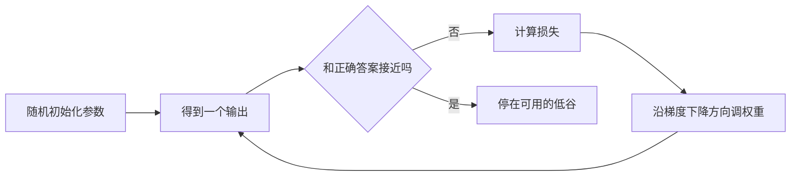
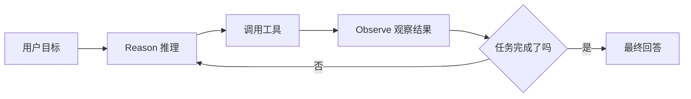
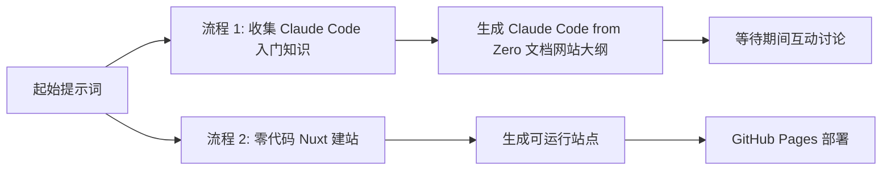

---
layout: cover
class: page-claude-from-zero page-home
---

<div class="cmpt-group-hero">
  <div>
    <div class="cmpt-kicker">Intro / Opening Chapter</div>
    <h1 class="mt-5">
      Claude from <span class="cmpt-grad-text">Zero</span>
    </h1>
    <p class="cmpt-group-hero__statement">
      从零到产物，给 AI Native 团队前夜的一份入门指南。
      不是学一个工具的按钮，而是用一个完整的应用制作过程，把 token、概率、agent、skills、MCP 串成一条能落地的线。
    </p>
    <div class="cmpt-group-hero__meta">
      <span>90 分钟</span>
      <span>产研团队</span>
      <span>从概念到产物</span>
      <span>Lionad</span>
    </div>
    <div class="mt-8 text-sm">
      GitHub:
      <a href="https://github.com/Lionad-Morotar" target="_blank">
        Lionad-Morotar
      </a>
    </div>
  </div>

  <div class="cmpt-panel rounded-[2rem] p-5">
    <GlassHeroScene class="cmpt-glass-hero-scene" />
  </div>
</div>

---
class: page-claude-from-zero
---

<div class="grid grid-cols-[1.1fr_0.9fr] gap-8 h-full items-center">
  <div>
    <div class="cmpt-kicker">01 / 自我介绍</div>
    <h2 class="mt-5">为什么是我来讲</h2>
    <div class="cmpt-quote mt-6">
      <strong>烧了 120 亿 token，做过几个小工具，上过阮一峰周刊。</strong>
    </div>
    <ul class="cmpt-bullet-list mt-7">
      <li>长期折腾 AI 工具链，既踩过坑，也把不少流程磨成了能复用的套路。</li>
      <li>今天不卖焦虑，只分享一条更容易上手、又足够专业的学习路径。</li>
      <li>目标不是让大家记住术语定义，而是记住怎么把术语用在做事的流程里。</li>
    </ul>
  </div>

  <div class="cmpt-side-stack">
    <div class="cmpt-panel cmpt-metric-card">
      <div class="cmpt-metric-card__label">实践尺度</div>
      <div class="cmpt-metric-card__value">120 亿</div>
      <div class="text-sm text-slate-300 mt-2">真实调用过的 token 量级</div>
    </div>
    <div class="cmpt-panel cmpt-metric-card">
      <div class="cmpt-metric-card__label">分享基调</div>
      <div class="cmpt-metric-card__value">不玄学</div>
      <div class="text-sm text-slate-300 mt-2">讲概念，但全部回到产品与工程视角</div>
    </div>
  </div>
</div>

---
class: page-claude-from-zero
---

<div class="grid grid-cols-[0.95fr_1.05fr] gap-8">
  <div>
    <div class="cmpt-kicker">02 / 分享目标</div>
    <h2 class="mt-5">这场分享想解决什么</h2>
    <p class="mt-5 text-lg leading-8">
      不是学一个工具怎么用，而是用完整的应用制作过程，为大家串联起转型成为 AI Native 团队前夜的必备知识点。
    </p>
    <div class="cmpt-footer-note">
      核心要义：AI 不是什么很难的事情，更多是把你过往经验拆出来，用新的工作流重新编排。
    </div>
  </div>

  <div class="cmpt-panel rounded-[1.7rem] p-6">
    <div class="text-sm uppercase tracking-[0.18em]">After 90 min</div>
    <ul class="cmpt-bullet-list mt-5">
      <li>对 token、大模型、MCP、skills、agent、vibe coding 有清晰概念。</li>
      <li>知道如何使用 Claude Code 走完一个微型应用的完整生命周期。</li>
      <li>消除“AI 很难”的心理壁垒，至少愿意开始试第一步。</li>
    </ul>
  </div>
</div>

---
class: page-claude-from-zero
---

<div class="cmpt-panel rounded-[1.7rem] p-6">
  <div class="cmpt-kicker">Timeline / 90 Min</div>
  <h2 class="mt-4">时间分配总览</h2>

  <table class="cmpt-table mt-6">
    <thead>
      <tr>
        <th>阶段</th>
        <th>时长</th>
        <th>内容</th>
      </tr>
    </thead>
    <tbody>
      <tr>
        <td>Intro</td>
        <td>10min</td>
        <td>封面、目标、为什么是 Claude Code</td>
      </tr>
      <tr>
        <td>LLM 是基于概率的</td>
        <td>25min</td>
        <td>概率、神经网络、学习机制</td>
      </tr>
      <tr>
        <td>Agent</td>
        <td>20min</td>
        <td>Token、Chat、Agent、工程概念</td>
      </tr>
      <tr>
        <td>Product from Zero</td>
        <td>30min</td>
        <td>现场演示零代码制作一个应用</td>
      </tr>
      <tr>
        <td>End</td>
        <td>5min</td>
        <td>收尾与 Q&A</td>
      </tr>
    </tbody>
  </table>
</div>

---
layout: cover
class: page-claude-from-zero
---

<div class="cmpt-group-hero">
  <div>
    <div class="cmpt-kicker">Group / Why Claude Code</div>
    <h1>Why Claude Code</h1>
    <p class="cmpt-group-hero__statement">
      本地、可控、深度集成。学 Claude Code，不是因为它看起来更酷，而是因为专业级产出离不开对关键中间环节的掌控。
    </p>
    <div class="cmpt-group-hero__meta">
      <span>高质量输入</span>
      <span>掌控细节</span>
      <span>减少切换成本</span>
    </div>
  </div>

  <div class="cmpt-side-stack">
    <div class="cmpt-panel rounded-[1.5rem] p-5">
      <div class="text-sm uppercase tracking-[0.16em]">Working Model</div>
      <div class="mt-5 grid grid-cols-3 gap-3 text-center">
        <div class="border-2 border-[#16110f] bg-[#f8f1e6] p-4">
          <div class="text-sm">Input</div>
          <div class="mt-2 text-xl">垫</div>
        </div>
        <div class="border-2 border-[#16110f] bg-[#f8f1e6] p-4">
          <div class="text-sm">Process</div>
          <div class="mt-2 text-xl">控制</div>
        </div>
        <div class="border-2 border-[#16110f] bg-[#f8f1e6] p-4">
          <div class="text-sm">Output</div>
          <div class="mt-2 text-xl">质量</div>
        </div>
      </div>
    </div>
  </div>
</div>

---
class: page-claude-from-zero
---

<div class="cmpt-section-grid">
  <div>
    <div class="cmpt-kicker">Why / 3 Dimensions</div>
    <h2 class="mt-5">为什么是 CC，而不是网页版 Agent</h2>
    <ul class="cmpt-bullet-list mt-6">
      <li><strong>高质量输出依赖高质量输入。</strong> 人在关键节点上“垫”一下，最终效果会差非常多。</li>
      <li><strong>专业程度来自掌控细节。</strong> 纯脑力和体力外包，不会沉淀出真正属于你的经验。</li>
      <li><strong>集成式环境减少上下文切换。</strong> 一件事在一个工作台里做完，思维损耗最小。</li>
    </ul>
  </div>

  <div class="cmpt-side-stack">
    <div class="cmpt-panel rounded-[1.5rem] p-5">
      <div class="text-white text-lg font-semibold">例子：先垫，再生成</div>
      <p class="mt-3 text-sm leading-7">
        先用高质量文生图模型生成漂亮照片，再把照片交给视频模型做运动扩展。
        每一步的“垫”都在把概率空间往更好的方向推。
      </p>
    </div>
    <div class="cmpt-panel rounded-[1.5rem] p-5">
      <div class="text-white text-lg font-semibold">IDE 的价值</div>
      <p class="mt-3 text-sm leading-7">
        工具不需要跳来跳去，文件、终端、上下文、结果都在一个环境里。
        这不是仪式感，是效率和稳定性。
      </p>
    </div>
  </div>
</div>

---
layout: cover
class: page-claude-from-zero
---

<div class="cmpt-group-hero">
  <div>
    <div class="cmpt-kicker">Group / LLM</div>
    <h1>LLM 是基于概率的</h1>
    <p class="cmpt-group-hero__statement">
      它不是查表，也不是 if-else。它是一个巨大的黑盒，通过海量参数，把“下一个最可能出现什么”算出来。
    </p>
    <div class="cmpt-group-hero__meta">
      <span>黑盒</span>
      <span>概率</span>
      <span>万亿参数</span>
    </div>
  </div>

  <div class="cmpt-panel rounded-[2rem] p-6">
    <ProbabilityBars class="cmpt-probability-bars" />
  </div>
</div>

---
class: page-claude-from-zero
---

<div class="grid grid-cols-[1.05fr_0.95fr] gap-8 items-start">
  <div>
    <div class="cmpt-kicker">01 / 小朋友怎么学习</div>
    <h2 class="mt-5">传统方法 vs 机器学习方法</h2>
    <ul class="cmpt-bullet-list mt-6">
      <li>传统方法：写无数个 if-else，条件永远补不完，也很难覆盖边缘情况。</li>
      <li>机器学习方法：不预设规则，让系统从数据中自己找到规律。</li>
      <li>人脑识别苹果时并不是顺序检查“颜色、形状、气味”，而是并行综合感知。</li>
    </ul>
  </div>

  <div class="cmpt-panel rounded-[1.7rem] p-6">
    <div class="grid grid-cols-2 gap-4">
      <div class="border-2 border-[#16110f] bg-[#f8f1e6] p-4">
        <div class="text-sm">传统方法</div>
        <pre class="mt-4 text-xs leading-6 text-[#16110f] whitespace-pre-wrap">if red and round and sweet:
  return apple
else:
  return ?</pre>
      </div>
      <div class="border-2 border-[#16110f] bg-[#f8f1e6] p-4">
        <div class="text-sm">机器学习</div>
        <div class="mt-4 text-sm leading-7">
          数据输入
          <br />
          并行处理
          <br />
          得到概率结果
        </div>
      </div>
    </div>
  </div>
</div>

---
class: page-claude-from-zero
---

<div class="cmpt-section-grid">
  <div>
    <div class="cmpt-kicker">02 / 神经网络结构</div>
    <h2 class="mt-5">输入层、隐藏层、输出层</h2>
    <ul class="cmpt-bullet-list mt-6">
      <li>左侧输入层：颜色、形状、气味等属性并行进入。</li>
      <li>中间隐藏层：发生了复杂计算，但我们无法直观看懂它在“想什么”。</li>
      <li>右侧输出层：给出“这是苹果”的概率结果。</li>
    </ul>
  </div>

  <div class="cmpt-panel rounded-[1.7rem] p-5">
    <NeuralNetwork class="cmpt-neural-network" :input-labels="['颜色', '形状', '气味', '触感']" :hidden-size="6" output-label="苹果" />
  </div>
</div>

---
class: page-claude-from-zero
---

<div class="cmpt-section-grid">
  <div>
    <div class="cmpt-kicker">03 / 规模带来质变</div>
    <h2 class="mt-5">从神经网络到大语言模型</h2>
    <p class="mt-5 text-lg leading-8">
      大语言模型本质上是一个超大规模神经网络。参数多到我们无法用传统统计学办法，去解释每个参数到底代表什么。
    </p>
    <div class="cmpt-footer-note">
      所以它对我们来说更像天气系统：能预测趋势，但中间细节不可完全解释。
    </div>
  </div>

  <div class="cmpt-panel rounded-[1.7rem] p-6">
    <div class="text-white text-lg font-semibold">为什么说“基于概率”</div>
    <ul class="cmpt-bullet-list mt-5">
      <li>输入有微小扰动，输出就可能明显变化。</li>
      <li>结果不是“确定事实”，而是“此刻最可能的生成结果”。</li>
      <li>工程目标不是消灭概率，而是管理概率、约束概率。</li>
    </ul>
  </div>
</div>

---
class: page-claude-from-zero
---

<div class="grid grid-cols-[1fr_1fr] gap-8 items-start">
  <div>
    <div class="cmpt-kicker">04 / AI 怎么学习</div>
    <h2 class="mt-5">损失、权重、梯度下降</h2>
    <ul class="cmpt-bullet-list mt-6">
      <li>每个节点的值来自所有输入与对应权重的加权求和。</li>
      <li>输出越接近真实答案，损失越小，说明模型学得越好。</li>
      <li>训练就是不断调整参数，让输出向正确答案逼近。</li>
    </ul>
  </div>

  <div class="cmpt-panel rounded-[1.7rem] p-6">
    <div class="cmpt-big-formula">Loss ↓  =>  Model Better</div>
    <p class="mt-5 text-sm leading-7">
      把模型想成在山谷里滚的小球。高处代表“没学会”，低处代表“学到了”。
      小球不断往低处滚，就是梯度下降最通俗的理解。
    </p>
    <div class="cmpt-footer-note">
      发布时不需要达到绝对 1.0，0.95 往往已经足够可用。
    </div>
  </div>
</div>

---
class: page-claude-from-zero
---

<div class="cmpt-panel rounded-[1.8rem] p-6">
  <div class="cmpt-kicker">Gradient / Visualization</div>
  <h2 class="mt-4">梯度下降示意图</h2>



  <div class="cmpt-footer-note">
    讲法建议：不要把重点放在数学推导，而是放在“不断试、不断纠偏、不断靠近”的直觉上。
  </div>
</div>

---
layout: cover
class: page-claude-from-zero
---

<div class="cmpt-group-hero">
  <div>
    <div class="cmpt-kicker">Group / Agent</div>
    <h1>Agent</h1>
    <p class="cmpt-group-hero__statement">
      Agent 的价值，不是让 LLM 看起来更聪明，而是用工程化手段，让概率性的输出在复杂任务里尽可能变得确定、可恢复、可交付。
    </p>
    <div class="cmpt-group-hero__meta">
      <span>ReAct</span>
      <span>工具调用</span>
      <span>长程任务</span>
    </div>
  </div>

  <div class="cmpt-panel rounded-[2rem] p-6">
    <ReActOrbit class="cmpt-react-orbit" />
  </div>
</div>

---
class: page-claude-from-zero
---

<div class="cmpt-section-grid">
  <div>
    <div class="cmpt-kicker">01 / 新模型关注什么</div>
    <h2 class="mt-5">最近的新模型在强调什么</h2>
    <ul class="cmpt-bullet-list mt-6">
      <li>“世界顶级推理性能”已经比较常见，大家大致知道是在说什么。</li>
      <li>“Agent 能力大幅提高”说明行业开始更在意复杂任务完成能力，而不是单轮问答。</li>
      <li>所以今天要回答的核心问题是：Chat 和 Agent 到底差在哪。</li>
    </ul>
  </div>

  <div class="cmpt-panel rounded-[1.7rem] p-6">
    <div class="text-white text-lg font-semibold">演示建议</div>
    <p class="mt-4 text-sm leading-7">
      用浏览器打开同一个产品的两种模式：对话模式与 Agent 模式。
      前者像补全回答，后者像拆任务、调工具、检查结果。
    </p>
  </div>
</div>

---
class: page-claude-from-zero
---

<div class="cmpt-section-grid">
  <div>
    <div class="cmpt-kicker">02 / Token</div>
    <h2 class="mt-5">Token 是 LLM 的“原子”</h2>
    <ul class="cmpt-bullet-list mt-6">
      <li>模型的输入输出看起来是文本，但真正参与计算的是 token。</li>
      <li>一段话会先被切成许多片段，再进入向量空间和神经网络。</li>
      <li>模型持续输出 token，我们才看到了完整句子。</li>
    </ul>
  </div>

  <div class="cmpt-panel rounded-[1.7rem] p-6">
    <TokenizationFlow class="cmpt-tokenization-flow" />
  </div>
</div>

---
class: page-claude-from-zero
---

<div class="grid grid-cols-[1fr_1fr] gap-8 items-start">
  <div>
    <div class="cmpt-kicker">03 / Chat</div>
    <h2 class="mt-5">Chat 其实是一种工程包装</h2>
    <ul class="cmpt-bullet-list mt-6">
      <li>本质仍然是输入输出，只是工程上把角色拆成了用户与助手。</li>
      <li>“用户：... 助手：...” 的格式，让模型做对话补全。</li>
      <li>多轮上下文一起发送，模型才知道你现在说的“上海”是在接天气问题。</li>
    </ul>
  </div>

  <div class="cmpt-panel rounded-[1.7rem] p-6">

```txt
用户：今天天气怎么样？
助手：你在上海还是北京？
用户：上海
助手：...
```

    <div class="cmpt-footer-note">
      上下文是有限的。塞太多，模型会“上下文溢出”，直接罢工。
    </div>
  </div>
</div>

---
class: page-claude-from-zero
---

<div class="cmpt-section-grid">
  <div>
    <div class="cmpt-kicker">Prompt / System</div>
    <h2 class="mt-5">提示词工程与系统提示</h2>
    <p class="mt-5 text-lg leading-8">
      你在做的事情，本质上是在给概率空间加导向。
      好的提示词不是玄学，而是把角色、背景、任务、风格、输出要求讲清楚。
    </p>
    <div class="cmpt-footer-note">
      提示词工程火过，系统提示留下来了。两者只是放置位置不同，目的相同。
    </div>
  </div>

  <div class="cmpt-side-stack">
    <PromptCard class="cmpt-prompt-card" />
    <div class="cmpt-panel rounded-[1.4rem] p-5">
      <div class="text-white font-semibold">CRISPE 框架</div>
      <div class="mt-4 grid grid-cols-2 gap-3 text-sm">
        <div>C: Capacity / Role</div>
        <div>R: Reason</div>
        <div>I: Insight</div>
        <div>S: Statement</div>
        <div>P: Personality</div>
        <div>E: Experiment</div>
      </div>
    </div>
  </div>
</div>

---
class: page-claude-from-zero
---

<div class="cmpt-panel rounded-[1.8rem] p-6">
  <div class="cmpt-kicker">04 / ReAct</div>
  <h2 class="mt-4">Agent = 让概率输出尽可能确定的工程框架</h2>



  <div class="cmpt-footer-note">
    如果今天只能记两个观点：一个是“概率”，另一个就是“ReAct 循环”。
  </div>
</div>

---
class: page-claude-from-zero
---

<div class="grid grid-cols-[1fr_1fr] gap-8 items-start">
  <div>
    <div class="cmpt-kicker">Tool Call</div>
    <h2 class="mt-5">工具调用在干什么</h2>
    <ul class="cmpt-bullet-list mt-6">
      <li>用户说“帮我查昨日出海订单”。</li>
      <li>模型先推理：我需要调用查询订单工具。</li>
      <li>工具层执行函数，返回“42 单”。</li>
      <li>模型再次推理：结果已确认，可以直接回答用户。</li>
    </ul>
  </div>

  <div class="cmpt-panel rounded-[1.7rem] p-5">
    <AgentLoop class="cmpt-agent-loop" />
  </div>
</div>

---
class: page-claude-from-zero
---

<div class="cmpt-panel rounded-[1.8rem] p-6">
  <div class="cmpt-kicker">05 / 高级概念</div>
  <h2 class="mt-4">MCP、A2A、Skills、RAG</h2>
  <div class="cmpt-mini-cards mt-6">
    <div class="cmpt-panel">
      <div class="text-white font-semibold">MCP</div>
      <p class="mt-2 text-sm leading-6">让模型能按协议调用外部工具。</p>
    </div>
    <div class="cmpt-panel">
      <div class="text-white font-semibold">A2A</div>
      <p class="mt-2 text-sm leading-6">Agent 与 Agent 之间的通信方式。</p>
    </div>
    <div class="cmpt-panel">
      <div class="text-white font-semibold">Skills</div>
      <p class="mt-2 text-sm leading-6">把做得好的流程沉淀成可复用文档。</p>
    </div>
  </div>
  <div class="cmpt-panel rounded-[1.3rem] p-5 mt-4">
    <div class="text-white font-semibold">RAG</div>
    <p class="mt-3 text-sm leading-7">
      海量知识不可能全部塞进提示词。先去数据库检索，再把相关内容和用户问题一起送给模型，这就是检索增强生成。
    </p>
  </div>
</div>

---
class: page-claude-from-zero
---

<div class="cmpt-section-grid">
  <div>
    <div class="cmpt-kicker">06 / OpenClaw & Claude Code</div>
    <h2 class="mt-5">Harness = Product - Agent</h2>
    <ul class="cmpt-bullet-list mt-6">
      <li>Agent 是最基础的 ReAct 循环。</li>
      <li>系统提示、记忆、文件系统、权限控制、技能、插件，这些围绕产品化的部分都属于 Harness。</li>
      <li>未来 AI 产品的差距，很多时候不在模型框架，而在 Harness 做得有多扎实。</li>
    </ul>
  </div>

  <div class="cmpt-side-stack">
    <div class="cmpt-panel rounded-[1.5rem] p-5">
      <div class="text-sm text-slate-300">公式</div>
      <div class="mt-3 text-3xl text-white font-semibold">Harness = Product - Agent</div>
    </div>
    <div class="cmpt-panel rounded-[1.5rem] p-5">
      <div class="text-white font-semibold">Claude Code 的定位</div>
      <p class="mt-3 text-sm leading-7">
        它虽然叫 Coding Agent，但本质上仍然是通用 Agent。
        只是恰好它的 Harness 对“做事”和“写代码”都特别强。
      </p>
    </div>
  </div>
</div>

---
layout: cover
class: page-claude-from-zero
---

<div class="cmpt-group-hero">
  <div>
    <div class="cmpt-kicker">Group / Claude from Zero</div>
    <h1>Claude from Zero</h1>
    <p class="cmpt-group-hero__statement">
      90 分钟前你还不会，90 分钟后你手里已经有一个上线的网站。
      理论讲完了，概念对齐了，接下来把它真正做出来。
    </p>
    <div class="cmpt-group-hero__meta">
      <span>现场演示</span>
      <span>零代码建站</span>
      <span>GitHub Pages</span>
    </div>
  </div>

  <div class="cmpt-panel rounded-[2rem] p-6">
    <div class="text-xl font-semibold">从 0 到网站</div>
    <div class="mt-6 h-4 overflow-hidden border-2 border-[#16110f] bg-[#d8c8b2]">
      <div class="h-full w-[86%] bg-[#a33124]" />
    </div>
    <div class="mt-6 text-sm leading-7">
      Prompt 设计 -> 并行收集知识 -> 零代码 Nuxt 建站 -> 演示部署上线
    </div>
  </div>
</div>

---
class: page-claude-from-zero
---

<div class="grid grid-cols-[0.95fr_1.05fr] gap-8">
  <div>
    <div class="cmpt-kicker">Demo / Flow</div>
    <h2 class="mt-5">现场演示流程</h2>
    <ol class="cmpt-bullet-list mt-6">
      <li>从 “grill me” 入手，写一条能带出分享目标的提示词。</li>
      <li>把结果引向两个并行流程：收集知识与零代码 Nuxt 建站。</li>
      <li>等待建站时，用准备好的金句和概念互动，不让现场冷掉。</li>
      <li>建站完成后，演示如何发布到 GitHub Pages。</li>
    </ol>
  </div>

  <div class="cmpt-side-stack">
    <div class="cmpt-panel rounded-[1.5rem] p-5">
      <div class="text-white font-semibold">时间控制策略</div>
      <ul class="cmpt-bullet-list mt-4">
        <li>若前半部分控制在 30 分钟左右，可边做边聊。</li>
        <li>若前面超时，就切到准备好的成品，压缩现场构建部分。</li>
      </ul>
    </div>
    <div class="cmpt-panel rounded-[1.5rem] p-5">
      <div class="text-white font-semibold">待分享前再验证一遍</div>
      <p class="mt-3 text-sm leading-7">
        建议完整跑通一次全流程，记录真实耗时，把不稳定环节提前替换成备用方案。
      </p>
    </div>
  </div>
</div>

---
class: page-claude-from-zero
---

<div class="cmpt-panel rounded-[1.8rem] p-6">
  <div class="cmpt-kicker">Demo / Parallel Paths</div>
  <h2 class="mt-4">现场要驱动出的两个并行流程</h2>


</div>

---
layout: cover
class: page-claude-from-zero
---

<div class="h-full flex flex-col justify-center">
  <div class="cmpt-kicker">End / Closing</div>
  <div class="mt-8 flex items-end gap-6">
    <div class="cmpt-end-mark">0</div>
    <div class="cmpt-end-mark" style="color: #a33124;">1</div>
    <div class="cmpt-end-mark cmpt-grad-text">∞</div>
  </div>
  <h1 class="mt-8">谢谢</h1>
  <p class="mt-4 max-w-3xl text-xl leading-8">
    你已经不是零基础了。接下来真正重要的，不是再背更多术语，而是开始把自己的经验拆出来，用 AI Native 的方式重构它。
  </p>
  <div class="cmpt-group-hero__meta mt-8">
    <span>继续提问</span>
    <span>继续试错</span>
    <span>继续做出东西</span>
  </div>
</div>
