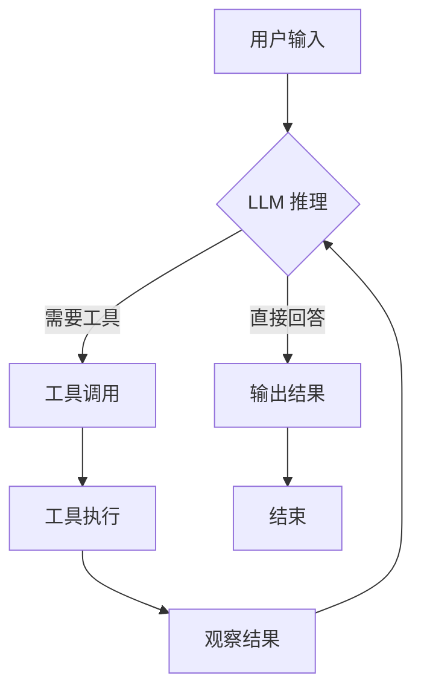
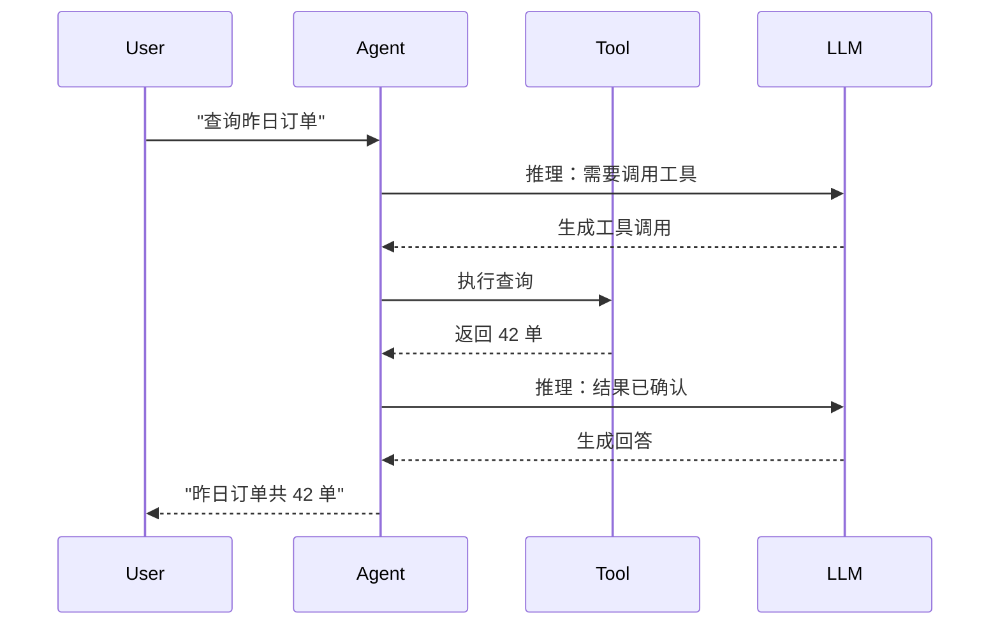
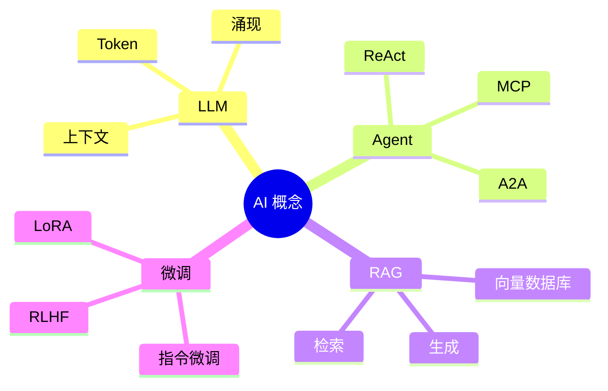
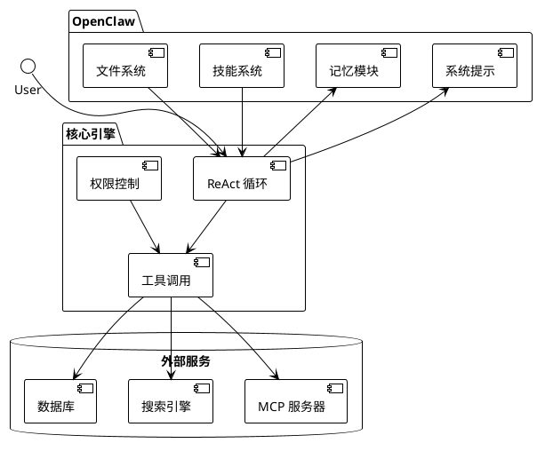

# Slidev

## 功能上限展示

<p v-click class="text-xl opacity-80 mt-4">
  为开发者打造的演示文稿框架
</p>

<div
  v-motion
  :initial="{ y: 40, opacity: 0 }"
  :enter="{ y: 0, opacity: 1, transition: { delay: 600 } }"
  class="mt-8 flex justify-center gap-4"
>
  <span class="px-3 py-1 rounded-full bg-white/20 text-sm">Vue 3</span>
  <span class="px-3 py-1 rounded-full bg-white/20 text-sm">Vite</span>
  <span class="px-3 py-1 rounded-full bg-white/20 text-sm">Markdown</span>
  <span class="px-3 py-1 rounded-full bg-white/20 text-sm">UnoCSS</span>
</div>

<style scoped>
.slidev-layout {
  background: linear-gradient(135deg, #667eea 0%, #764ba2 100%) !important;
  color: white !important;
}
</style>

---
layout: center
class: text-center
---

# 本章节目录

<div class="grid grid-cols-2 gap-8 text-left mt-8 max-w-2xl mx-auto">

<div v-click>

### 基础能力
- Markdown 语法
- 多种布局
- 代码高亮

</div>

<div v-click>

### 图表与可视化
- Mermaid 图表
- PlantUML
- LaTeX 公式

</div>

<div v-click>

### 动画与交互
- v-click 动画
- v-motion 运动
- Vue 组件

</div>

<div v-click>

### 演示功能
- 演讲者模式
- 绘图批注
- 导出部署

</div>

</div>

<Toc maxDepth="1" class="hidden" />

---
layout: center
class: text-center text-white
---

# Chapter 1

## Markdown 与布局系统

<style scoped>
.slidev-layout {
  background: linear-gradient(to right, #1e3c72, #2a5298) !important;
  color: white !important;
}
</style>

---

# Markdown 基础

Slidev 的核心是 **Markdown**，所有内容都用 Markdown 编写。

## 标题与文本

你可以使用标准的 Markdown 语法：

- **粗体**、*斜体*、~~删除线~~
- [链接](https://sli.dev)、`行内代码`
- 引用块：

> "LLM 是基于概率的。" — 这是今天最重要的一句话。

## 列表

<v-clicks>

1. 第一步：理解 Token
2. 第二步：理解神经网络
3. 第三步：理解 Agent

</v-clicks>

---
layout: two-cols
---

# 两列布局

左侧可以放置文字说明：

- 使用 `layout: two-cols` 启用
- 使用 `::right::` 分隔右侧内容
- 两侧内容独立排版

<v-click>

## 代码在左侧

```python
def hello():
    print("Hello Slidev!")
```

</v-click>

::right::

# 右侧内容

<v-clicks>

- 可以放图片
- 可以放代码
- 可以放组件
- 甚至可以放**视频**

</v-clicks>

<div v-click class="mt-4 p-4 bg-blue-50 rounded-lg">

### 提示框

这是右侧的一个提示框，使用 UnoCSS 样式

</div>

---
layout: image-right
image: https://sli.dev/logo.png
---

# 图片布局

使用 `layout: image-right` 将图片放在右侧。

其他布局选项：

- `layout: image-left` — 图片在左
- `layout: image` — 全屏图片背景
- `layout: center` — 内容居中
- `layout: cover` — 封面页

<v-click>

## Frontmatter 配置

每个幻灯片都可以用 YAML frontmatter 配置：

```yaml
---
layout: image-right
image: /path/to/image.png
class: text-white
background: '#1a1a2e'
---
```

</v-click>

---
layout: center
class: text-center
---

# Chapter 2

## 代码展示

<style scoped>
.slidev-layout {
  background: linear-gradient(to right, #11998e, #38ef7d) !important;
  color: white !important;
}
</style>

---

# Shiki 代码高亮

Slidev 使用 **Shiki**（VS Code 同款引擎）进行代码高亮。

```ts
import { ref, computed } from 'vue'

// 响应式状态
const count = ref(0)

// 计算属性
const doubled = computed(() => count.value * 2)

// 方法
function increment() {
  count.value++
}
```

支持 **200+** 种编程语言，包括：

`typescript` `python` `rust` `go` `vue` `tsx` `bash` `yaml` `json`

---

# 行级动画

使用 `{line-numbers}` 语法高亮特定行：

```ts {1|3|5|7|all}
// 步骤 1：定义响应式状态
const count = ref(0)

// 步骤 2：定义计算属性
const doubled = computed(() => count.value * 2)

// 步骤 3：定义方法
function increment() {
  count.value++
}
```

语法说明：

- `{1|3|5|7|all}` — 依次高亮第 1、3、5、7 行，最后全部
- `{2-4|6-8}` — 高亮行范围
- `{*|2|*}` — `*` 表示"其他所有行"

---

# Monaco 编辑器

使用 `{monaco}` 将代码块变成**可编辑的 Monaco 编辑器**：

```ts {monaco}
// 试着修改这段代码！
function greet(name: string): string {
  return `Hello, ${name}!`
}

console.log(greet('Slidev'))
```

<v-click>

使用 `{monaco-run}` 可以**直接执行代码**：

```ts {monaco-run}
const fib = [1, 1]
for (let i = 2; i < 10; i++) {
  fib.push(fib[i - 1] + fib[i - 2])
}
console.log(fib)
```

</v-click>

---

# TwoSlash 类型提示

启用 `twoslash` 获得 TypeScript 悬停类型信息：

```ts twoslash
import { ref, computed } from 'vue'

const count = ref(0)
//     ^?

const doubled = computed(() => count.value * 2)
//      ^?

function greet(name: string) {
  return `Hello ${name}`
}
//     ^?
```

鼠标悬停在代码上查看类型推导！

---
layout: center
class: text-center
---

# Chapter 3

## 图表与可视化

<style scoped>
.slidev-layout {
  background: linear-gradient(to right, #fc466b, #3f5efb) !important;
  color: white !important;
}
</style>

---

# Mermaid 流程图



---

# Mermaid 时序图



---

# Mermaid 思维导图



---

# PlantUML 架构图



---

# LaTeX 数学公式

行内公式：$E = mc^2$、$\nabla \cdot \vec{E} = \frac{\rho}{\varepsilon_0}$

块级公式（支持点击动画）：

$$ {1|2|3|all}
\begin{aligned}
\text{损失函数} \quad & L = -\sum_{i} y_i \log(\hat{y}_i) \\
\text{梯度} \quad & \nabla_\theta L = \frac{\partial L}{\partial \theta} \\
\text{更新} \quad & \theta_{t+1} = \theta_t - \eta \nabla_\theta L
\end{aligned}
$$

---
layout: center
class: text-center
---

# Chapter 4

## 动画系统

<style scoped>
.slidev-layout {
  background: linear-gradient(to right, #f093fb, #f5576c) !important;
  color: white !important;
}
</style>

---

# v-click 基础动画

点击逐步显示内容：

<v-click>

### 第一步

这是第一次点击后显示的内容。

</v-click>

<v-click>

### 第二步

这是第二次点击后显示的内容。

</v-click>

<v-click>

### 第三步

这是第三次点击后显示的内容，支持 **Markdown** 格式。

</v-click>

---

# v-clicks 列表动画

使用 `<v-clicks>` 自动为列表项添加点击动画：

<v-clicks depth="2">

- **Token**
  - 文本的最小单元
  - 经过特定处理后作为神经网络的输入
- **上下文**
  - 模型能记住的对话历史
  - 长度有限制，超过会"溢出"
- **涌现**
  - 参数规模突破临界点后
  - 模型突然获得新能力

</v-clicks>

---

# v-click 修饰符

```html
<div v-click>默认出现</div>
<div v-click.fade-in>淡入效果</div>
<div v-click.up>从下方滑入</div>
<div v-click.fade>变暗效果 (0.5 透明度)</div>
<div v-click.fade.right.scale>组合效果</div>
<div v-click.hide>出现后又消失</div>
<div v-click="3">指定在第 3 次点击时出现</div>
<div v-click="[2, 4]">在第 2~3 次点击间显示</div>
```

<div class="grid grid-cols-2 gap-2 mt-4">
  <div v-click class="p-2 rounded bg-blue-50 text-sm">默认</div>
  <div v-click.fade-in class="p-2 rounded bg-green-50 text-sm">淡入</div>
  <div v-click.up class="p-2 rounded bg-purple-50 text-sm">从下方</div>
  <div v-click.hide class="p-2 rounded bg-orange-50 text-sm">出现并消失</div>
</div>

---

# v-motion 高级动画

基于 @vueuse/motion 的复杂动画：

<div class="flex items-center justify-center h-40">
  <div
    v-motion
    :initial="{ x: -100, opacity: 0, rotate: -45 }"
    :enter="{ x: 0, opacity: 1, rotate: 0, transition: { type: 'spring', damping: 10, stiffness: 20 } }"
    :click="{ scale: 1.2, rotate: 360, transition: { duration: 600 } }"
    class="w-24 h-24 bg-gradient-to-br from-blue-400 to-purple-600 rounded-xl flex items-center justify-center text-white text-2xl font-bold cursor-pointer"
  >
    点我
  </div>
</div>

<v-click>

支持的状态：

- `:initial` — 初始状态
- `:enter` — 进入状态
- `:click` / `:click-3` — 第 N 次点击后的状态
- `:leave` — 离开状态（幻灯片切换时）

</v-click>

---

# 幻灯片过渡

每个幻灯片可以设置不同的过渡效果：

```yaml
---
transition: slide-left    # 向左滑入
---
transition: slide-right   # 向右滑入
---
transition: slide-up      # 向上滑入
---
transition: fade          # 淡入淡出
---
transition: view-transition # 视图过渡（实验性）
---
```

还可以设置**双向不同过渡**：

```yaml
---
transition: slide-left | slide-right
---
```

---
layout: center
class: text-center
---

# Chapter 5

## Vue 组件

<style scoped>
.slidev-layout {
  background: linear-gradient(to right, #4facfe, #00f2fe) !important;
  color: white !important;
}
</style>

---

# 自定义 Vue 组件

在 `components/` 目录创建 `.vue` 文件，即可在 Markdown 中直接使用：

## 交互式计数器

<Counter :count="10" class="mt-4" />

<v-click>

## 神经网络可视化

<NeuralNetwork :input-labels="['颜色', '形状', '气味', '触感']" hidden-size="6" output-label="苹果" />

</v-click>

---

# Token 分词可视化

<TokenFlow />

---

# ReAct Agent 循环

<AgentLoop />

---

# 梯度下降可视化

<GradientDescent />

---

# 概率分布演示

<ProbabilityDemo />

---

# 内置组件

Slidev 提供丰富的内置组件：

<div class="grid grid-cols-2 gap-4 text-sm">

<div>

### 导航
- `<Link to="5">` — 跳转到第 5 页
- `<Link to="intro">` — 通过 routeAlias 跳转
- `<Toc minDepth="1" maxDepth="2">` — 目录
- `<Arrow x1="0" y1="0" x2="100" y2="100">` — 箭头

</div>

<div>

### 媒体
- `<Tweet id="...">` — 嵌入推文
- `<Youtube id="...">` — 嵌入视频

### 信息
- `<SlideCurrentNo /> / <SlidesTotal />` — 页码

</div>

<div v-click>

### 高级
- `<Transform>` — 变换容器
- `<RenderWhen>` — 条件渲染
- `<LightOrDark>` — 明暗模式适配

</div>

<div v-click>

### 图标

使用任意 Iconify 图标集：

<div class="flex gap-2 text-2xl">
  <div class="i-carbon:logo-github" />
  <div class="i-carbon:logo-vue" />
  <div class="i-carbon:logo-react" />
  <div class="i-carbon:code" />
  <div class="i-carbon:ai-status-complete" />
  <div class="i-carbon:machine-learning" />
</div>

</div>

</div>

---
layout: center
class: text-center
---

# Chapter 6

## 高级功能

<style scoped>
.slidev-layout {
  background: linear-gradient(to right, #fa709a, #fee140) !important;
  color: white !important;
}
</style>

---

# 绘图与批注

Slidev 内置**Drauu**绘图引擎，演示时可以：

<div class="grid grid-cols-3 gap-4 mt-6">

<div v-click class="p-4 rounded-lg bg-gray-50 text-center">
  <div class="text-3xl mb-2">✏️</div>
  <div class="font-medium">自由绘制</div>
  <div class="text-xs text-gray-500 mt-1">画笔、荧光笔</div>
</div>

<div v-click class="p-4 rounded-lg bg-gray-50 text-center">
  <div class="text-3xl mb-2">⬜</div>
  <div class="font-medium">形状工具</div>
  <div class="text-xs text-gray-500 mt-1">矩形、椭圆、直线</div>
</div>

<div v-click class="p-4 rounded-lg bg-gray-50 text-center">
  <div class="text-3xl mb-2">📝</div>
  <div class="font-medium">文字批注</div>
  <div class="text-xs text-gray-500 mt-1">在幻灯片上打字</div>
</div>

</div>

<v-click>

## 配置

```yaml
---
drawings:
  enabled: true
  persist: false      # 是否保存绘图
  presenterOnly: true # 仅演讲者可见
---
```

</v-click>

---

# 演讲者模式

按 `P` 键打开演讲者视图：

<div class="grid grid-cols-2 gap-6 mt-4">

<div>

### 演讲者视图包含：

- 当前幻灯片
- 下一张预览
- **演讲者备注**（本页底部的注释）
- 计时器
- 导航控制

</div>

<div class="bg-gray-900 text-white p-4 rounded-lg text-sm">

### 键盘快捷键

| 按键 | 功能 |
|------|------|
| `→` / `Space` | 下一页 |
| `←` / `Shift+Space` | 上一页 |
| `P` | 演讲者模式 |
| `O` | 概览模式 |
| `G` | 跳转到指定页 |
| `F` | 全屏 |
| `D` | 绘图模式 |

</div>

</div>

<!--
Speaker Notes:
- 这是演讲者备注
- 观众看不到这段内容
- 可以在演示时查看提示
- 支持 Markdown 格式
-->

---

# 概览模式

按 `O` 键打开概览模式，查看所有幻灯片缩略图：

<div class="text-center py-8">
  <div class="text-6xl mb-4">🗂️</div>
  <p class="text-xl">按 <kbd class="px-2 py-1 bg-gray-100 rounded">O</kbd> 体验概览模式</p>
  <p class="text-sm text-gray-500 mt-2">可以快速跳转到任意幻灯片</p>
</div>

---

# 录制功能

Slidev 支持**内置录制**：

```bash
# 启动录制模式
npx slidev --record

# 录制时自动保存为视频
# 支持画中画（摄像头 + 幻灯片）
```

<v-click>

## 导出选项

```bash
# 导出为 PDF
npx slidev export

# 导出为 PNG 图片
npx slidev export --format png

# 导出为 PPTX
npx slidev export --format pptx

# 包含点击动画
npx slidev export --with-clicks
```

</v-click>

---

# 样式定制

Slidev 使用 **UnoCSS**，可以在 Markdown 中直接写类名：

<div class="grid grid-cols-3 gap-3 mt-4">

<div class="p-3 rounded bg-red-100 text-red-700 text-center">
  <div class="text-2xl font-bold">bg-red-100</div>
  <div class="text-xs">text-red-700</div>
</div>

<div class="p-3 rounded bg-green-100 text-green-700 text-center">
  <div class="text-2xl font-bold">bg-green-100</div>
  <div class="text-xs">text-green-700</div>
</div>

<div class="p-3 rounded bg-blue-100 text-blue-700 text-center">
  <div class="text-2xl font-bold">bg-blue-100</div>
  <div class="text-xs">text-blue-700</div>
</div>

</div>

<v-click>

也可以写内联 `<style>` 标签：

```html
<style>
h1 {
  background: linear-gradient(45deg, #4EC5D4, #146b8c);
  -webkit-background-clip: text;
  -webkit-text-fill-color: transparent;
}
</style>
```

</v-click>

---
layout: center
class: text-center
---

# Chapter 7

## 综合演示

<style scoped>
.slidev-layout {
  background: linear-gradient(to right, #a8edea, #fed6e3) !important;
  color: white !important;
}
</style>

---

# 综合：LLM 工作原理

<div class="grid grid-cols-2 gap-6">

<div>

## 输入处理

文本 → **Token** → 数值向量

<TokenFlow />

</div>

<div v-click>

## 神经网络

并行计算 → 概率输出

<NeuralNetwork :input-labels="['词1', '词2', '词3', '位置']" :hidden-size="4" output-label="下一个词" />

</div>

</div>

---

# 综合：Agent ReAct 循环

<AgentLoop />

<v-click>

## 关键概念

| 概念 | 说明 |
|------|------|
| **ReAct** | Reasoning + Acting 的循环 |
| **工具调用** | LLM 决定何时调用外部工具 |
| **观察** | 将工具结果反馈给 LLM |
| **循环** | 直到任务完成或达到最大步数 |

</v-click>

---

# 综合：概率与不确定性

<ProbabilityDemo />

<v-click>

## 为什么 LLM 会"幻觉"

1. **概率采样** — 从概率分布中随机选择下一个 Token
2. **温度参数** — 温度越高，输出越随机
3. **上下文限制** — 无法访问实时信息时可能编造
4. **训练数据局限** — 知识的截止日期

</v-click>

---

# 综合：训练过程

<div class="grid grid-cols-2 gap-6">

<div>

## 梯度下降

通过调整参数使损失最小化：

<GradientDescent />

</div>

<div v-click>

## 训练步骤

<v-clicks>

1. **前向传播** — 计算预测结果
2. **计算损失** — 预测 vs 真实值的差距
3. **反向传播** — 计算梯度
4. **参数更新** — 沿梯度下降方向调整
5. **重复** — 直到收敛

</v-clicks>

</div>

</div>

---
layout: center
class: text-center
---

# 本章要点回顾

<div class="grid grid-cols-2 gap-6 text-left">

<div>

### 核心能力
- ✅ Markdown + Vue 3 驱动
- ✅ Shiki 代码高亮 + 行级动画
- ✅ Monaco 编辑器 + 代码执行
- ✅ Mermaid / PlantUML 图表
- ✅ LaTeX 数学公式

</div>

<div>

### 高级特性
- ✅ v-click / v-motion 动画
- ✅ Vue 组件自定义交互
- ✅ 演讲者模式 + 概览模式
- ✅ 绘图批注 + 录制
- ✅ UnoCSS 样式 + 主题系统

</div>

</div>

<div v-click class="mt-8 text-xl text-gray-500">

Slidev = Markdown 的简洁 + Vue 的强大 + Web 的无限可能

</div>

---

# Slidev 安装

```bash
# 创建新项目
pnpm create slidev

# 或安装 CLI
pnpm add -g @slidev/cli

# 启动开发服务器
pnpm slidev

# 构建
pnpm slidev build

# 导出
pnpm slidev export
```

---
layout: cover
class: text-center
---

# 谢谢

## 用 Slidev 打造你的下一场技术分享

<div class="mt-8">
  <a href="https://sli.dev" target="_blank" class="text-lg opacity-80 hover:opacity-100">
    sli.dev
  </a>
</div>

<div class="mt-4 flex justify-center gap-3 opacity-60">
  <div class="i-carbon:logo-github text-2xl" />
  <div class="i-carbon:logo-twitter text-2xl" />
  <div class="i-carbon:logo-vue text-2xl" />
</div>

<style>
  h1 {
    background-image: linear-gradient(45deg, #4EC5D4 10%, #146b8c 20%);
    background-size: 100%;
    -webkit-background-clip: text;
    -moz-background-clip: text;
    -webkit-text-fill-color: transparent;
    -moz-text-fill-color: transparent;
  }
</style>