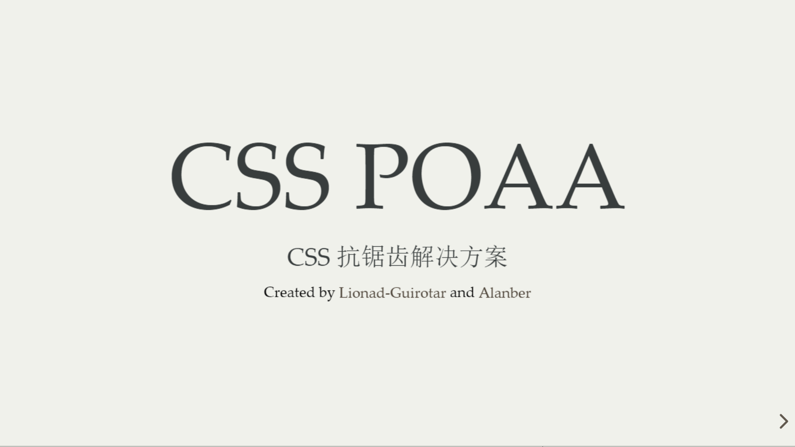

# POAA-PPT

## 说明

  
有没有带交互的讲稿下载？

  
木有，演讲的演示是用 Reveal.js 写的，可以看成一份网页，而不是 PPT，转成 PPT 后会丢失交互效果，所以如果想玩儿或者改代码的话辛苦大家先看一下项目结构啦~

  
如何运行？

  <ul>
    <li>1. 首先确保你的电脑有 NodeJS 环境
    <li>2. npm install -g http-server
    <li>3. http-server ./ -p8080
    <li>4. 访问 http://localhost:8080/index.html 就能看到结果了
  </ul>

## 演示

- [封面](./cover.png)

- [视频](./snapshot.mp4)

---

## 更多资料

见我的博客[《CSS 幻术 | 抗锯齿》](https://mgear-blogs.obs-website.cn-east-3.myhuaweicloud.com/articles/css-poaa.html)

  
代码问题或需要支援？

  
请联系一光：yangyunshu@baixing.com

